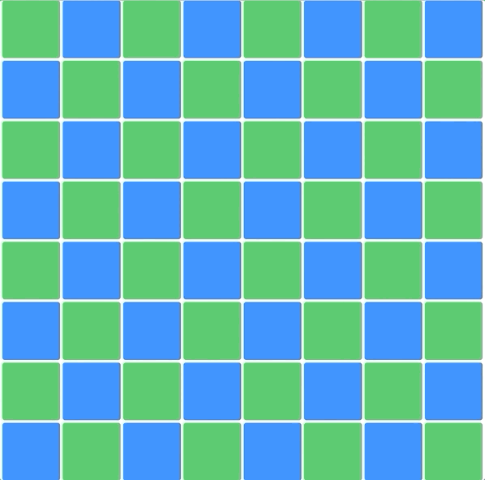

# Preferences

Solution project for the March 7th, 2020 Meetup for Flock of Swifts.

The coding challenge is to use `GeometryReader`, `PreferenceKey` and `OnPreferenceChange` to create a grid of views that report their frames up the view tree to the root view so that it can use these frames in a gesture recognizer to select the cells as you drag over them.

